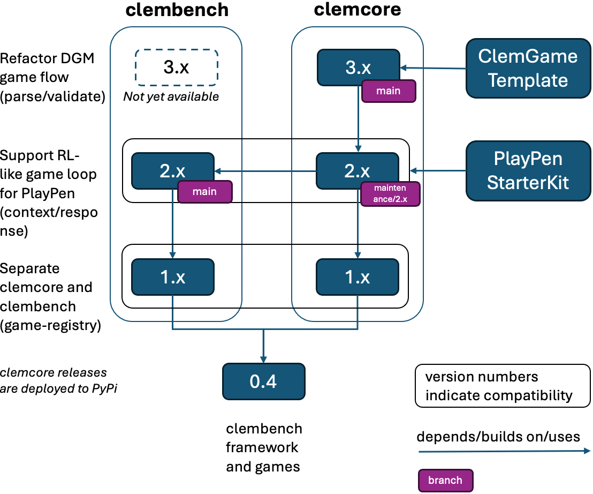

## Collections of games to be run with the [clemcore framework](https://github.com/clp-research/clemcore)

## Installation (Python 3.10+)

Install the required dependencies to run all games: 

`pip install -r clembench/requirements.txt`

This will also install the `clem` CLI tool.

### Models, Backends, Games

After the installation you will have access to the `clem` CLI tool. The main functions are:

```
(myclem) clem list games               # list the games available for a run
(myclem) clem list backends            # list the backends available for a run
(myclem) clem list models              # list the models available for a run
(myclem) clem run -g <game> -m <model> # runs the game benchmark; also scores
(myclem) clem transcribe               # translates interactions into html files
(myclem) clem score                    # computes individual performance measures
(myclem) clem eval                     # computes overall performances measures; requires scores
```

To add new custom models, populate the `model_registry.json` file with the required fields  (template is provided as *model_registry.json.template*).

To run your custom game, populate the `game_registry.json` file with the required fields and directory path (template is provided as *game_registry.json.template*).

### API Keys

To use APIs (OpenAI, Anthropic, Google, Mistral, etc.), create a `key.json` file that includes the required fields for each backend. 
The template file (key.json.template) is provided.

Copy the file into `<userhome>/.clemcore/` to make it generally available.

## Using the Benchmark

### Workspace Directory (recommended)

We recommend creating a specific workspace directory to work with clembench, which contains the benchmark game directories and optional files.  
The `clem` CLI command operates relative to the current working directory, that is, the directory it is called from. 
The workspace directory serves as a convenient working directory.

Workspace directory contents may look like this:
```
(optional) key.json
(optional) game_registry.json 
(optional) model_registry.json  
(optional) custom_api.py 
clembench/
```

The files have the following functions:
- **key.json**: Contains secrets for the remote API calls; if this file does not exist, then `clem` looks into 
`~/.clemcore/`.
- **game_registry.json**: Allows to make additional game specifications usable for the runs. The game specifications 
must at least contain the `game_name`, `game_path` and `players` attribute.
- **model_registry.json**: Allows to add additional model specifications. This is specifically useful to run with models 
that have not been packaged yet. In addition, it allows to point model specification to custom backend names.
- **custom_api.py**: `clem` automatically discovers additional _api files placed into the cwd, so that users of the 
framework can run their own backends with the games.
- **clembench/**: Contains the game directories (with the game code) available for the benchmark runs.

Note that `clem` does automatically discover game directories that are at most 3-levels away from the current working directory/`cwd`.
To be discoverable, game directories have to carry a `clemgame.json` (here a game path is not required, because `clem` automatically determines it).

### Use Case: Benchmark Available Models

To prepare running multiple models for all games that constitute the Clembench benchmark, checkout the [clembench](https://github.com/clp-research/clembench) repository into a new [workspace directory](#recommended-workspace). 
To access remote API backends, add a `key.json` containing the respective API access keys to the workspace directory.
In addition, you might need to add additional model entries that are not yet packaged to a `model_registry.json`.  

To run all available games on for example `model1`, execute `clem run -g all -m model1` in a terminal. The example `model1` is the key string for the model to be run in the model registry (either packaged `clemcore/clemcore/backends/model_registry.json` or custom `model_registry.json` in the workspace directory). 
To run multiple models, we currently recommend using a batch script containing multiple clem CLI calls, one for each model.

By default, result files will be stored in the current working directory, in the `results` subdirectory. 
Results can be stored in a different directory by executing `clem run -g all -m model1 -r <other_directory>`, with `<other_directory>` being the path to the target directory.

Hence, a benchmarking workspace directory might look as follows:
```
myworkspace
- clembench/
- results/
- key.json 
- model_registry.json  
```

As an exemplary workflow and a more concrete showcase, let's say, we want to know how well the `Meta-Llama-3.1-8B-Instruct` model performs on the benchmark.
For this, we let the model play the games in the benchmark. 
The following command runs the model on the games that were selected for version `v2.0` of the benchmark: 
```bash
clem run -g "{'benchmark':['2.0']}" -m Meta-Llama-3.1-8B-Instruct 
```

You can also use `-g all` to run all games or, for example, `-g taboo` to run just a specific game.

After the `run` command has finished, a `results` folder appears which contains the recorded interactions of gameplay.
We score the interactions with the following command:

```bash
clem score # Note: -r option defaults to 'results' 
```

You can also use, for example, `-g taboo` to score just a specific game.

The score command creates `score.json` in each episode directory which we use for the overall evaluation.
The evaluation runs with the following command:

```bash
clem eval # Note: -r option defaults to 'results'
```

This creates a `results.csv` and `results.html` which presents the overall aggregated result and for each game individually. 

> **Note:** The `clem` CLI has become available during workspace setup when we installed the `requirements.txt`.

### Use Case: Benchmark Custom Models

To test the performance of your own model on the benchmark, checkout the [clembench](https://github.com/clp-research/clembench) repository into your [workspace directory](#recommended-workspace).
To make your model available to `clem`, create a `model_registry.json` with the specifications of your model in the working directory.
The model registry entry must at least specify a name and a backend:
```
{
  "model_name":"mymodel",
  "backend":"mybackend"
}
```
More information on the model registry is available in the [model registry and backends readme](docs/model_backend_registry_readme.md).  

#### Custom backend

If your model is not compatible with the packaged local backends (HuggingFace `transformers`, `llama-cpp-python`, `vLLM`) it requires a custom backend. 
In this case, create a `mybackend_api.py` in the workspace directory which implements the `generate_response` method for the model and might specify how it is loaded. 

All backend module files must be named `<backend name>_api.py`, with `<backend name>` being the backend to refer to in the model registry. 
For more information on custom backends, see the [adding models and backends howto](docs/howto_add_models.md). 

`clem` tries to locate all non-package backend modules in the workspace directory. Therefore, your model's registry 
entry must match the backend module, with the model entry `"backend"` key value matching the `<backend name>` of your 
custom `<backend name>_api.py` backend module file.

#### Running clembench with your model
Run `clem -g all -m mymodel` from the workspace directory to run your model on all games. The results will be stored in the `results` subdirectory. 
Hence, a model developers workspace might look as follows:
```
myworkspace
- clembench/
- results/
- model_registry.json
- mybackend_api.py  
```

### Use Case: Training a Model

The use case for training models on data generated by gameplay is available at the [playpen repository](https://github.com/phisad/playpen) (still under development).

### Use Case: Game Development

To implement your own game to be run with `clem`, we recommend using a typical clem game project structure, with the game directory as your [workspace directory](#recommended-workspace). 
To make the game visible to `clem` you need to add a `clemgame.json` to the directory.
This file must specify at least the following (possible values separated by ` | `):
```
{
  "game_name": "mygame",
  "description": "A brief description of mygame",
  "player": "single" | "two" | "multi",
  "image": "none" | "single" | "multi",
  "languages": ["en"]
}
```
To test your game with a packaged model, run the command `clem run -g mygame -m model` from within the game directory.
The results will be written into a `results` subdirectory. 
To generate HTML transcripts of your game run's episodes run `clem transcribe -g mygame`.
To use remote API backends, add a `key.json` with your remote 
API access key(s) to the workspace directory. 

Overall, a game developers workspace directory will possibly look as follows:
```
mygame
- in/
- resources/
- results/
- __init__.py
- master.py
- instancegenerator.py
- clemgame.json
- key.json   
```
For more information on creating and adding clemgames, see [howto add games](docs/howto_add_games.md), [howto add games example](docs/howto_add_games_example.ipynb), [howto prototype games](docs/howto_prototype_games.ipynb) and the [logging and scoring docs](docs/logging_and_scoring.md).

# Contributing

We welcome you to contribute to or extend the benchmark with your own games and models. 
Please open a pull request in the respective repository. 
You can find more information on how to use the benchmark in the links below.

However, the following documentation needs still to be checked for up-to-dateness.

- [How to run the benchmark and evaluation locally](docs/howto_run_benchmark.md)
- [How to run the benchmark, update leaderboard workflow](docs/howto_benchmark_workflow.md)
- [How to add a new model](docs/howto_add_models.md)
- [How to add and run your own game](docs/howto_add_games.md)


# Versioning

The clembench release versions tags are structured like `major.minor.patch` where

- `major` indicates the compatibility with a major clemcore version e.g. `2.x.x` is only compatible with clemcore versions `2.x.x`
- `minor` indicates changes to the games in the benchmark that don't affect compatibility with clemcore e.g. refactorings, additions or removals of games
- `patch` indicates smaller adjustments or hotfixes to the games that don't affect compatibility with clemcore 

The following image visualizes the established dependencies and version history:

<a href="versions.png">
    
</a>
