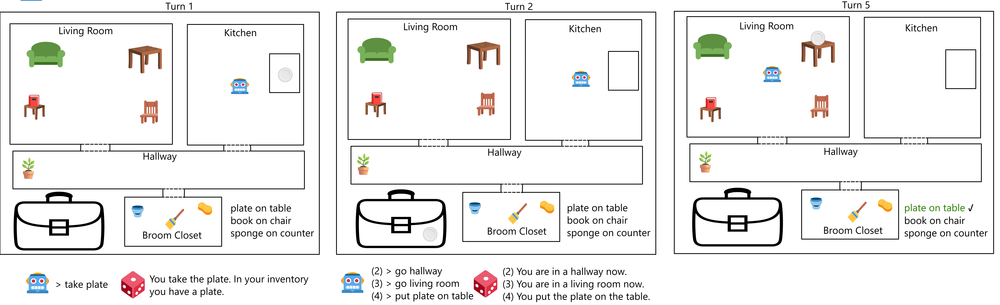
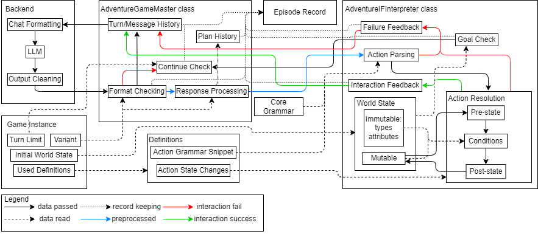

# AdventureGame
AdventureGame is an Interactive Fiction/Text Adventure clemgame. The current version is v2.1.  

The model is given descriptions of rooms and their contents, along with a task, and interacts with the game world by 
giving action commands. The IF interpreter changes the game world state based on the given action or returns a textual 
failure response if that is not possible.  
The model is also prompted to end the game with "> done" once it has achieved the given goal.
## Overview

This flowchart shows the core process of AdventureGame. Some connections are omitted for visual clarity, as it's mainly 
showing how the [benchmark](master.py) and [the IF interpreter code](if_wrapper.py) interact. Read files are located in 
the [instances](in) and [resources](resources) directories.
## Instantiation
### Adventure Generation
The Clingo Answer Set solver is used to generate viable initial world state sets based on room and entity definitions. 
These initial world states are used to create goal sets via script. Initial world states and task goal sets are combined 
into adventures. As a last step, Clingo is used to generate the optimal solution for each adventure, using action 
definitions.  
Each step above can output intermediate adventures for manual editing, which was used to create the v2.1 set of adventures 
with two difficulty levels. Difficulty is based on the accessibility of task objects and the complexity of tasks, which 
are easy to manipulate at an intermediate stage that has generated initial world states and goal sets, but no optimal 
solution yet. An example JSON file of that stage is `adventuregame/resources/adv_source.json`.
### Instances
Different prompts are used for two game variants, 'basic' and 'planning', to generate two instance sets from the 
same pool of adventures. v2.1 has an added difficulty variant limited the inventory to two objects. This means that the 
initial world state and goal sets are identical between the 'basic' and 'planning' variants for each difficulty - 
'basic-easy' instance 0 has the same adventure as 'planning-easy' instance 0.
### v2.1 Task
For the v2.1 instances, the task is to deliver three objects to target receptacles in a common home setting, prompted as 
"put X in/on Y". In 'easy' instances, the target receptacle for all objects is the same table, whereas 'hard' instances 
require delivering the objects to different receptacles each.
## Evaluation
### Metrics
Standard clembench metrics are implemented, metrics listed here are AdventureGame-specific metrics.
#### Turn-level
goal_score: How many goal states have been achieved at this turn. Records **change** of the number of achieved goal 
states, meaning that if less goal states are achieved at this turn compared to the turn before, the number is negative.
#### Episode-level
achieved_goal_ratio: Ratio of achieved goal states by total adventure goal states. 1.0 if all goal states are achieved, 
0.0 if none are achieved. Recorded regardless of successful finish and aborting.  
BENCH_SCORE: `achieved_goal_ratio * 100` to fit expected scale of clemgame quality scores as used in the overall 
clemscore.  
#### Interaction Failures
IF Interaction failures are recorded at each turn. They are divided by two phases, parsing and resolution.  
Parsing phase failures are `lark_exception`, `malformed_command`, `undefined_action_verb`, `undefined_action`, 
`undefined_repr_str`, `manipulating_room` (due to action type not allowing room as argument), `undefined_argument_type`.  
Resolution phase failures are `not_room_type` ('go' action with undefined/non-existing room argument), 
`going_to_current_room`, `no_exit_to` (no passage to argument room present), `entity_already_inventory` ('take'-ing 
entity that is already in inventory), `manipulating_room` (ie '> take kitchen'), `entity_not_accessible`, 
`taking_from_inventory` (due to 'inventory' argument) and `interacting_with_other_room` (due to other room than current 
location as second argument; ie '> take plate from kitchen' while not in kitchen), among others.